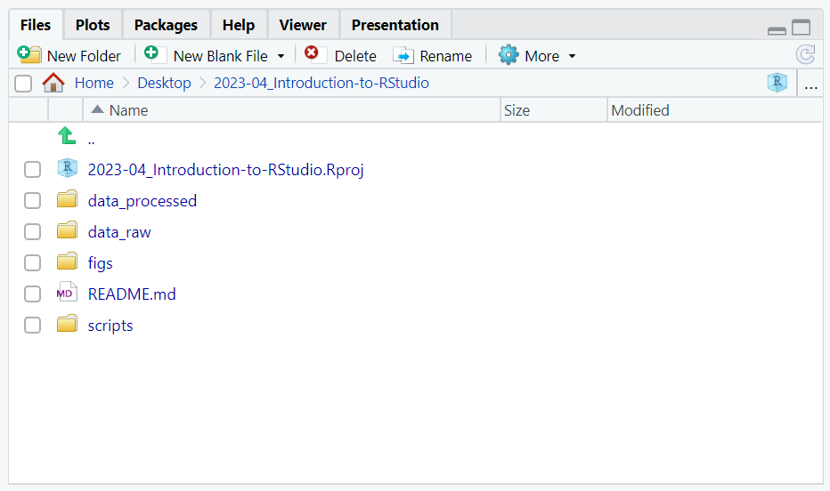
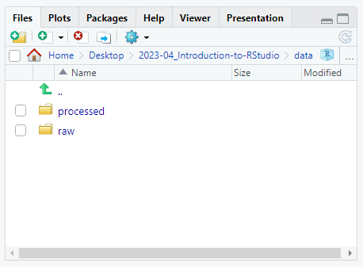

## What is R? 

The term "`R`" is used to refer to both the programming language and the
software that interprets the scripts written using it.

- R is a powerful programming language used for statistical computing and graphics, popular among data analysts, statisticians, and researchers.

- R provides a wide range of statistical and graphical techniques, making it a versatile tool for data analysis, data visualization, and modeling.

- R has a large and active community of users and developers, which provides extensive support, documentation, and packages for various tasks, such as data manipulation, machine learning, and data visualization.

- R is an open-source language, which means it is free to use, modify, and distribute, making it accessible to a wide range of users.

- R has a rich ecosystem of packages that extend its functionality, allowing users to tailor their analyses to specific domains or tasks, and making it a flexible and customizable language for data analysis and visualization.

## What is RStudio?

[RStudio](https://rstudio.com) is currently a very popular way to not
only write your R scripts but also to interact with the R software. To
function correctly, RStudio needs R and therefore both need to be
installed on your computer.

> ## Discussion: Your experience and expectations
>
> -   What has motivated you to learn R? Have you had a research
>     question for which spreadsheet programs such as Excel have proven
>     difficult to use, or where the size of the data set created
>     issues?
> -   In what situations do you imagine that using R will be most
>     valuable to you? {: .discussion}

## Knowing your way around RStudio

Let's start by learning about [RStudio](https://www.rstudio.com/), which
is an Integrated Development Environment (IDE) for working with R.

The RStudio IDE open-source product is free under the [Affero General
Public License (AGPL)
v3](https://www.gnu.org/licenses/agpl-3.0.en.html). The RStudio IDE is
also available with a commercial license and priority email support from
RStudio, PBC.

We can use RStudio IDE to write code, navigate the files on our
computer, inspect the variables we are going to create, and visualize
the plots we will generate. RStudio can also be used for other things
(e.g., version control, developing packages, writing Shiny apps).
Version control will be introduced later on, but packages and Shiny apps
will not be covered during the workshop.

#### RStudio is divided into 4 "Panes":

1.  **Source Editor Pane**: The Source Editor Pane (top-left, in the
    default layout) is where you write and edit your R code. It provides
    a variety of features to help you write code efficiently, including
    syntax highlighting, code completion, and automatic indentation.
    Syntax highlighting makes it easier to identify different elements
    of your code, such as keywords, functions, and variables, by using
    different colors. Code completion suggests possible completions as
    you type, helping you write code more quickly and accurately.
    Automatic indentation helps maintain consistent code formatting by
    automatically adjusting the indentation level as you type.

2.  **Environment and History Pane**: The Environment and History Pane
    (top-right) provides information about the current state of your R
    environment. It displays a list of variables, functions, and data
    objects that are currently available in your R session, along with
    their values and attributes. You can also use this pane to create,
    modify, and delete variables and objects in your R environment.
    Additionally, the Environment and History Pane allows you to view
    and manage your command history, which is a record of previously
    executed commands. You can search, filter, and recall commands from
    your command history, making it convenient for revisiting and
    reusing past code.

3.  **Plots and Help Pane**: The Plots and Help Pane (bottom-right)
    serves two main purposes. Firstly, it displays plots and
    visualizations generated by R code, making it easy to visualize data
    and analyse results. Plots can be interactive and resizable,
    allowing you to explore and customize visualizations to suit your
    needs. Secondly, the Plots and Help Pane provides access to R
    documentation and help files. You can search for help on R
    functions, packages, and other resources directly from RStudio. The
    Help Pane also displays the documentation for the currently selected
    R object in your environment, making it convenient for quickly
    referencing documentation while coding.

4.  **Console Pane**: The Console Pane (bottom-left) is where you
    interact with the R programming language. You can enter R commands
    directly into the console, execute them by pressing Enter, and view
    the results. The console displays the output of executed commands,
    such as printed results, error messages, and warnings. You can also
    use the console to interact with the R environment, including
    assigning values to variables, loading data, and installing and
    loading packages. The console also supports command history,
    allowing you to scroll through and recall previously executed
    commands.

The placement of these panes and their content can be customized (see
menu, Tools -\> Global Options -\> Pane Layout).

One of the advantages of using RStudio is that all the information you
need to write code is available in a single window. Additionally, with
many shortcuts, autocompletion, and highlighting for the major file
types you use while developing in R, RStudio will make typing easier and
less error-prone.

## Create an RStudio project

It is good practice to keep a set of related data, analyses, and text
self-contained in a single folder, called the **working directory**. All
of the scripts within this folder can then use *relative paths* to files
that indicate where inside the project a file is located (as opposed to
absolute paths, which point to where a file is on a specific computer).
Working this way makes it a lot easier to move your project around on
your computer and share it with others without worrying about whether or
not the underlying scripts will still work.

RStudio provides a helpful set of tools to do this through its
"Projects" interface, which not only creates a working directory for
you, but also remembers its location (allowing you to quickly navigate
to it) and optionally preserves custom settings and open files to make
it easier to resume work after a break. Go through the steps for
creating an "R Project" for this tutorial below.

1.  Start RStudio.
2.  Under the `File` menu, click on `New Project`. Choose
    `New Directory`, then `New Project`.
3.  Enter a name for this new folder (or "directory"), and choose a
    convenient location for it. This will be your **working directory**
    (e.g., `~/r_intro`).
4.  Click on `Create Project`.
5.  (Optional) Set Preferences to "Never" save workspace in RStudio.

A workspace is your current working environment in R which includes any
user-defined object. By default, all of these objects will be saved, and
automatically loaded, when you reopen your project. Saving a workspace
to `.RData` can be cumbersome, especially if you are working with larger
datasets, and it can lead to hard to debug errors by having objects in
memory you forgot you had. To turn that off, go to Tools --\> "Global
Options" and select the "Never" option for "Save workspace to .RData" on
exit.

### Organizing your working directory

Using a consistent folder structure across your projects will help keep
things organized, and will also make it easy to find/file things in the
future. This can be especially helpful when you have multiple projects.
In general, you may create directories (folders) for **scripts**,
**data**, **data/raw**, **data/processed** and **figs**.

-   **`data/` & `data/raw` & `data/processed`** Use these folders to
    store raw data and intermediate datasets you may create for the need
    of a particular analysis. For the sake of transparency and
    [provenance](https://en.wikipedia.org/wiki/Provenance), you should
    *always* keep a copy of your raw data accessible and do as much of
    your data cleanup and preprocessing programmatically (i.e., with
    scripts, rather than manually) as possible. Separating raw data from
    processed data is also a good idea.
-   **`figs/`** This would be the place to keep plots and figures generated from the code.
-   **`scripts/`** This would be the location to keep your R scripts for
    different analyses or plotting, and potentially a separate folder
    for your functions (more on that later).
-   **Additional (sub)directories** depending on your project needs.

#### How it should look like

### Creating a README file

It is good practice to create a [README text
file](https://www.makeareadme.com) at the top level of your working
directory to provide the context of the files in the directory. Making
this a habit can save you many hours of work, as it will allow you to
quickly get into a project again after being away from it for some time.
You may also find a README file helpful when you collaborate with others
around a bunch of files.

1.  Under the `File` menu, first click on `New File`, and then select
    `Text File`.
2.  Enter the text "Course material for learning R" into the new file.
3.  Save the file to your working directory and call it simply `README`.

Your working directory should now look like this:

> ## Writing the README file in Markdown
>
> While READMEs can be written in any text file format, it is nowadays
> very common to use the [Markdown
> language](https://www.markdownguide.org) (the files are then usaully
> named "README.md"). Markdown is a lightweight markup language that
> makes it relatively easy to add text formatting using a plain-text
> editor. {: .callout}

### The working directory

The working directory is an important concept to understand. It is the
place from where R will be looking for and saving the files. When you
write code for your project, it should refer to files in relation to the
root of your working directory and only need files within this
structure.

Using RStudio projects makes this easy and ensures that your working
directory is set properly. If you need to check it, you can use
`getwd()`. If for some reason your working directory is not what it
should be, you can change it in the RStudio interface by navigating in
the file browser where your working directory should be, and clicking on
the blue gear icon "More", and select "Set As Working Directory".
Alternatively you can use `setwd("/path/to/working/directory")` to reset
your working directory. However, your scripts should not include this
line because it will fail on someone else's computer.

## Seeking help

### Searching function documentation with `?` and `??`

If you need help with a specific function, let's say `mean()`, you can
type `?mean` or press <kbd>F1</kbd> while your cursor is on the function
name. If you are looking for a function to do a particular task, but
don't know the function name, you can use the double question mark `??`,
for example `??kruskall`. Both commands will open matching help files in
RStudio's help panel in the lower right corner. You can also use the
help panel to search help directly, as seen in the screenshot.

### Automatic code completion

When you write code in RStudio, you can use its automatic code
completion to remind yourself of a function's name or arguments. Start
typing the function name and pay attention to the suggestions that pop
up. Use the up and down arrow to select a suggested code completion and
<kbd>Tab</kbd> to apply it. You can also use code completion to complete
function's argument names, object, names and file names. It even works
if you don't get the spelling 100% correct.

### Package vignettes and cheat sheets

In addition to the documentation for individual functions, many packages
have *vignettes* -- instructions for how to use the package to do
certain tasks. Vignettes are great for learning by example. Vignettes
are accessible via the package help and by using the function
`browseVignettes()`.

There is also a Help menu at the top of the RStudio window, that has
cheat sheets for popular packages, RStudio keyboard shortcuts, and more.

### Finding more functions and packages

RStudio's help only searches the packages that you have installed on
your machine, but there are many more available on
[CRAN](https://cran.r-project.org/) and [GitHub](https://github.com/).
To search across all available R packages, you can use the website
[rdocumentation.org](https://www.rdocumentation.org). Often, a generic
Google or internet search "R \<task\>" will send you to the appropriate
package documentation or a forum where someone else has already asked
your question. Many packages also have websites with additional help,
tutorials, news and more (for example
[tidyverse.org](https://www.tidyverse.org/)).

### Dealing with error messages

Don't get discouraged if your code doesn't run immediately! Error
messages are common when programming, and fixing errors is part of any
programmers daily work. Often, the problem is a small typo in a variable
name or a missing parenthesis. Watch for the red x's next to your code
in Rstudio. These may provide helpful hints about the source of the
problem.

If you can't fix an error yourself, start by googling it. Some error
messages are too generic to diagnose a problem (e.g. "subscript out of
bounds"). In that case it might help to include the name of the function
or package you're using in your query.

### Asking for help

If your Google search is unsuccessful, you may want to ask other R users
for help. There are different places where you can ask for help. During
this workshop, don't hesitate to talk to your neighbor, compare your
answers, and ask for help. You might also be interested in organizing
regular meetings following the workshop to keep learning from each
other. If you have a friend or colleague with more experience than you,
they might also be able and willing to help you.

Besides that, there are a few places on the internet that provide help:

-   [Stack
    Overflow](https://stackoverflow.com/questions/tagged/r?tab=Votes):
    Many questions have already been answered, but the challenge is to
    use the right words in your search to find them. If your question
    hasn't been answered before and is well crafted, chances are you
    will get an answer in less than 5 min. Remember to follow their
    guidelines on [how to ask a good
    question](https://stackoverflow.com/help/how-to-ask).
-   The [R-help mailing
    list](https://stat.ethz.ch/mailman/listinfo/r-help): it is used by a
    lot of people (including most of the R core team). If your question
    is valid (read its [Posting
    Guide](https://www.r-project.org/posting-guide.html)), you are
    likely to get an answer very fast, but the tone can be pretty dry
    and it is not always very welcoming to new users.
-   If your question is about a specific package rather than a base R
    function, see if there is a mailing list for the package. Usually
    it's included in the DESCRIPTION file of the package that can be
    accessed using `packageDescription("<package-name>")`.
-   You can also try to contact the package author directly, by emailing
    them or opening an issue on the code repository (e.g., on GitHub).
-   There are also some topic-specific mailing lists (GIS,
    phylogenetics, etc...), the complete list is
    [here](https://www.r-project.org/mail.html).

> ## Summary
>
> In this tutorial, we provided a brief overview of the programming language R and 
> demonstrated how to navigate in RStudio. In the next section, we will delve deeper into 
> our newfound knowledge by continuing with practical examples of R programming. 
> Specifically, we will further develop our R Project by incorporating real data into our folders, 
> thereby enriching our learning experience in RStudio.
>
> Next up is the introduction to scripted analysis with R.
{: .callout}

